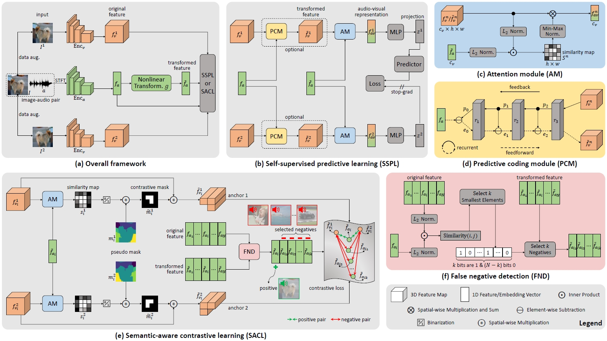

# SACL: Semantic-Aware Contrastive Learning for Sound Source Localization
This repository hosts the PyTorch code for implementing the SACL approach for sound source localization. SACL is built 
upon our previous work on sound source localization, i.e., [SSPL](https://github.com/zjsong/SSPL/tree/main) (CVPR 2022).


## Paper
**Enhancing Sound Source Localization via False Negative Elimination** <br/>
[Zengjie Song](https://zjsong.github.io/), 
[Jiangshe Zhang](https://gr.xjtu.edu.cn/en/web/jszhang/english), 
[Yuxi Wang](https://scholar.google.com/citations?hl=en&user=waLCodcAAAAJ), 
[Junsong Fan](https://scholar.google.com/citations?user=AfK4UcUAAAAJ&hl=en&oi=ao), 
[Zhaoxiang Zhang](https://zhaoxiangzhang.net/) <br/>
IEEE Transactions on Pattern Analysis and Machine Intelligence (T-PAMI), 2024 <br/>
[Paper](https://ieeexplore.ieee.org/abstract/document/10637713) | [arXiv](https://arxiv.org/abs/2408.16448) <br/>

> **Abstract:** *Sound source localization aims to localize objects emitting the sound in visual scenes. Recent works 
> obtaining impressive results typically rely on contrastive learning. However, the common practice of randomly 
> sampling negatives in prior arts can lead to the false negative issue, where the sounds semantically similar to 
> visual instance are sampled as negatives and incorrectly pushed away from the visual anchor/query. As a result, 
> this misalignment of audio and visual features could yield inferior performance. To address this issue, we propose 
> a novel audio-visual learning framework which is instantiated with two individual learning schemes: self-supervised 
> predictive learning (SSPL) and semantic-aware contrastive learning (SACL). SSPL explores image-audio positive pairs 
> alone to discover semantically coherent similarities between audio and visual features, while a predictive coding 
> module for feature alignment is introduced to facilitate the positive-only learning. In this regard SSPL acts as a 
> negative-free method to eliminate false negatives. By contrast, SACL is designed to compact visual features and 
> remove false negatives, providing reliable visual anchor and audio negatives for contrast. Different from SSPL, 
> SACL releases the potential of audio-visual contrastive learning, offering an effective alternative to achieve the 
> same goal. Comprehensive experiments demonstrate the superiority of our approach over the state-of-the-arts. 
> Furthermore, we highlight the versatility of the learned representation by extending the approach to audio-visual 
> event classification and object detection tasks.*




## Dependencies
We have tested the code on the following environment:
* Python 3.9.18 | PyTorch 2.0.0 | torchvision 0.15.0 | CUDA 11.8 | Ubuntu 20.04.4


## Download & pre-process videos
Following [SSPL](https://github.com/zjsong/SSPL/tree/main), we train models on respectively two video datasets: [SoundNet-Flickr](http://soundnet.csail.mit.edu/) and [VGG-Sound](https://www.robots.ox.ac.uk/~vgg/data/vggsound/), 
while testing on two corresponding benchmarks: [test set](https://github.com/ardasnck/learning_to_localize_sound_source) of SoundNet-Flickr 
and [test set](https://www.robots.ox.ac.uk/~vgg/research/lvs/) (i.e., VGG-Sound Source) of VGG-Sound. The details of data preprocessing can be found in the subsection Implementation Details in the main text.

Take SoundNet-Flickr for example, the final data should be placed in the following structure:
```
Datasets
│
└───SoundNet_Flickr
│   │
|   └───10k_unlabeled
|   |   |   h5py_train_frames_10k.h5
|   |   |   h5py_train_audios_10k.h5
|   |   |   h5py_train_spects_10k.h5
|   |   |
|   └───144k_unlabeled
|   |   |   h5py_train_frames_144k_1.h5
|   |   |   ...
|   |   |   h5py_train_frames_144k_10.h5
|   |   |   h5py_train_audios_144k_1.h5
|   |   |   ...
|   |   |   h5py_train_audios_144k_10.h5
|   |   |   h5py_train_spects_144k_1.h5
|   |   |   ...
|   |   |   h5py_train_spects_144k_10.h5
|   |   |
|   └───5k_labeled
|   |   |
|   |   └───Annotations
|   |   |   |   10000130166.xml
|   |   |   |   ...
|   |   |   |   9992947874.xml
|   |   |   |
|   |   └───Data
|   |       |
|   |       └───audio
|   |       |   |   10000130166.wav
|   |       |   |   ...
|   |       |   |   9992947874.wav
|   |       |   |
|   |       └───frames
|   |           |   10000130166.jpg
|   |           |   ...
|   |           |   9992947874.jpg
|   |           |
|   └───flickr_test249_in5k.csv
|
└───VGG-Sound
    │
    └───10k_unlabeled
    |
    └───144k_unlabeled
    |
    └───5k_labeled
    |   |
    |   └───Annotations
    |   |   |   vggss_test_5158.json
    |   |   |
    |   └───Data
    |       |   h5py_test_frames.h5
    |       |   h5py_test_audios.h5
    |       |   h5py_test_spects.h5
    |       |
    └───vggss_test_4692.csv
```
**Note:**
* We provide ```flickr_test249_in5k.csv```, ```vggss_test_4692.csv```, and ```vggss_test_5158.json``` in ```metadata/```.
* Before training and testing, specify ```data_path = "path to Datasets"``` in ```arguments_train.py``` and ```arguments_test.py``` accordingly.


## Models
For your convenience, we provide the following trained models on SoundNet-Flickr and VGG-Sound, respectively. Notice that for more fair comparisons, it would be better to re-train and then test SACL (as well as other related models) on your own datasets.

| SACL model                                                                                                       | Training set        | Test set         | cIoU  |  AUC  |
|:-----------------------------------------------------------------------------------------------------------------|:--------------------|:-----------------|:-----:|:-----:|
| [sacl_train_f10k_test_f](https://drive.google.com/file/d/1fiP1lVU7a-PqkcbGdvcBNOz7V1yJ8D4w/view?usp=drive_link)  | SoundNet-Flickr10k  | SoundNet-Flickr  | 0.815 | 0.623 |
| [sacl_train_f144k_test_f](https://drive.google.com/file/d/174pLlS2s-zKLOsoB7BUDwHtSZTt0YYKk/view?usp=drive_link) | SoundNet-Flickr144k | SoundNet-Flickr  | 0.851 | 0.623 |
| [sacl_train_v10k_test_v](https://drive.google.com/file/d/1bNND4TH70cEwJhGsP0cjdi1-h0wwHRL3/view?usp=drive_link)  | VGG-Sound10k        | VGG-Sound Source | 0.360 | 0.397 |
| [sacl_train_v144k_test_v](https://drive.google.com/file/d/1Gy_EAdctbRcRkD9rpJxQX7tK4dlkMurF/view?usp=drive_link) | VGG-Sound144k       | VGG-Sound Source | 0.380 | 0.400 |


## Usage
### Training
We utilize [ResNet-18](https://openaccess.thecvf.com/content_cvpr_2016/papers/He_Deep_Residual_Learning_CVPR_2016_paper.pdf) and [VGGish](https://github.com/harritaylor/torchvggish) as backbones 
to extract visual and audio features, respectively. Before training, place the pre-trained ResNet-18 weights ([resnet18-5c106cde.pth](https://download.pytorch.org/models/resnet18-5c106cde.pth)) in ```models/resnet/```; 
place the pre-trained VGGish weights ([vggish-10086976.pth](https://github.com/harritaylor/torchvggish/releases/download/v0.1/vggish-10086976.pth)) in ```models/torchvggish/torchvggish/vggish_pretrained/```. To train SACL on SoundNet-Flickr10k with default setting, simply run:
```
python main.py
```

### Test
After training, ```frame_best.pth``` and ```sound_best.pth``` can be obtained, and place them in ```models/pretrain/``` before testing. To test SACL on SoundNet-Flickr 
with default setting, simply run:
```
python test.py
```


## Citation
Please consider citing our papers in your publications if the project helps your research.
```
@inproceedings{song2022self,
  title={Self-Supervised Predictive Learning: A Negative-Free Method for Sound Source Localization in Visual Scenes},
  author={Song, Zengjie and Wang, Yuxi and Fan, Junsong and Tan, Tieniu and Zhang, Zhaoxiang},
  booktitle={Proceedings of the IEEE/CVF Conference on Computer Vision and Pattern Recognition},
  pages={3222--3231},
  year={2022}
}
```
```
@article{song2024enhancing,
  title={Enhancing Sound Source Localization via False Negative Elimination},
  author={Song, Zengjie and Zhang, Jiangshe and Wang, Yuxi and Fan, Junsong and Zhang, Zhaoxiang},
  journal={IEEE Transactions on Pattern Analysis and Machine Intelligence},
  year={2024}
}
```


## Acknowledgement
Our code is inspired by [Sound-of-Pixels](https://github.com/hangzhaomit/Sound-of-Pixels) and [HardWay](https://github.com/hche11/Localizing-Visual-Sounds-the-Hard-Way).
